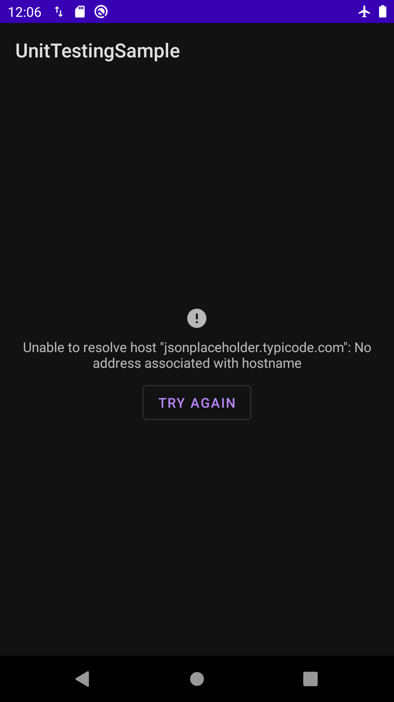

# AndroidUnitTesting
[](https://codebeat.co/projects/github-com-brunogabriel-androidunittesting-main)

A simple project to help developers in writing their unit tests in Android Platform. This is not a multi-module project, but has their concepts, for example featured package represents a feature module or something like that.

## Build with

* [Kotlin](https://kotlinlang.org/) - Programming language
* [Model View ViewModel - MVVM](https://en.wikipedia.org/wiki/Model%E2%80%93view%E2%80%93viewmodel) with Clean Architecture Concepts
* [Android Jetpack](https://developer.android.com/jetpack/?gclid=CjwKCAiA0svwBRBhEiwAHqKjFmred6a9m5PIr1ndfJOBeHecGRWmLeuAaMNuYGxpsFrCH5-dkI2cghoCGUwQAvD_Bw)
* [Hilt](https://developer.android.com/training/dependency-injection/hilt-android) - Dependency Injection
* [Retrofit](https://square.github.io/retrofit/)
* [RxJava](https://github.com/ReactiveX/RxJava) - Reactive paradigm
* [Mockk](https://mockk.io/) - Friendly way to mock in Kotlin
* [Truth](https://truth.dev/) - Same as description, a fluent assertions for Android

## MVVM Architecture descriptions

In a posts package we can represent Clean Architecture structure with data, domain and presentation folders respectively. Our view model structure is using ViewFlipper to listen/show their behaviour like show success, error, try again or empty result.

## Testing Model

To write our unit tests, I used a very common approach from BDD, [GivenWhenThen](https://martinfowler.com/bliki/GivenWhenThen.html). In resume, given a scenario, when an action is executed, then we have a new behaviour or result.

### Testing tools

The two principal external tools used here are Mockk and Truth.

Mockk has a lot of facilities for create mocks, spies, etc.

Truth same as their description a fluent tool, in my opinion is solving a Java assertion ambiguous problem: AssertThat(x, is(y)). I read different codes versions in web like tutorials, githubs, etc., with sometimes x is mock/fake result and another cases y.

## Show case

Some images from this sample:

<p>
    
    
    
</p>

## Testing Rx Results with Mocks

In a popular approach like RxJava, for testing we can just using their own tool. For example, supposing a simple method that returns a `Single<T>`, like our repository, we need some steps:

1 - First mock the result of our dependency (in our case, service)
2 - Call function `test` from Rx library, this function will create a TestObserver
3 - Compare results: mock vs call result

In step 3, we use `assertResult` because internally, this function will verify if has no errors and complete the chain. Do not forget to call `dispose` to avoid memory leaks or flaky tests.

```kotlin

class PostsRepositoryImpl @Inject constructor(
    private val service: PostService
) : PostsRepository {
    override fun getPosts(): Single<List<PostResponse>> = service.getPosts()
}

```

```kotlin
// given
val posts = listOf<PostResponse>(mockk(), mockk())
every { repository.getPosts() } returns Single.just(posts)

// when
val result = repository.getPosts()

// then
result.test()
    .assertResult(posts)
    .dispose()
```

## Testing ViewModel with LiveData

The hard part of our code.

For testing LiveData results, generally I prefer to use spies approach. In Mockk we use spyks. Basically we are listening LiveData forever and will store LiveData changes in a mutableList. In this case, capture results with Spyks.

Our steps:

1 - Create spyks to observe or capture changes in our LiveData
2 - Mock view model dependencies behaviour
3 - Observe live data changes passing spyks (item 1)
4 - Call function responsible for change LiveData value
5 - Verify if spyks are capture LiveData changes
6 - Use capture mutableList to compare values

```kotlin
val errorMessage: LiveData<String>
```

```kotlin
// given
val observerErrorMessage = spyk<Observer<String>>()
val errorResults = mutableListOf<String>()

// mock view model dependencies
viewModel.errorMessage.observeForever(observerErrorMessage)

// when
viewModel.takePosts()

// then
verify { observerErrorMessage.onChanged(capture(errorResults)) }
assertThat(errorResults.size).isEqualTo(1)
assertThat(errorResults.first()).isEqualTo(DEFAULT_ERROR_MESSAGE)
```

This example is so simple, but in this repository I created very simple calls in same way as a guide.


## API

The API used is [JSONPlaceholder](https://jsonplaceholder.typicode.com/), the data model is [Post](https://jsonplaceholder.typicode.com/posts):
```json
[
  {
    "userId": 1,
    "id": 1,
    "title": "sunt aut facere repellat provident occaecati excepturi optio reprehenderit",
    "body": "quia et suscipit\nsuscipit recusandae consequuntur expedita et cum\nreprehenderit molestiae ut ut quas totam\nnostrum rerum est autem sunt rem eveniet architecto"
  },
  {
    "userId": 1,
    "id": 2,
    "title": "qui est esse",
    "body": "est rerum tempore vitae\nsequi sint nihil reprehenderit dolor beatae ea dolores neque\nfugiat blanditiis voluptate porro vel nihil molestiae ut reiciendis\nqui aperiam non debitis possimus qui neque nisi nulla"
  }
]
```

## License

This project is licensed under the MIT License - see the [LICENSE](LICENSE) file for details